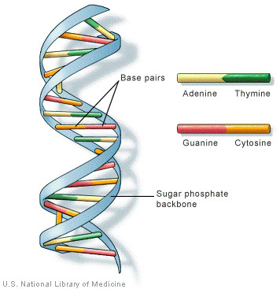

# DNA SEQUENCING:

# Introduction

A genome is a complete collection of DNA in an organism. All living species possess a genome, but they differ considerably in size. The human genome, for instance, is arranged into 23 chromosomes, which is a little bit like an encyclopedia being organized into 23 volumes. And if you counted all the characters (individual DNA “base pairs”), there would be more than 6 billion in each human genome. So it’s a huge compilation.

A human genome has about 6 billion characters or letters. If you think the genome(the complete DNA sequence) is like a book, it is a book about 6 billion letters of “A”, “C”, “G” and “T”. Now, everyone has a unique genome. Nevertheless, scientists find most parts of the human genomes are alike to each other.

As a data-driven science, genomics extensively utilizes machine learning to capture dependencies in data and infer new biological hypotheses. Nonetheless, the ability to extract new insights from the exponentially increasing volume of genomics data requires more powerful machine learning models. By efficiently leveraging large data sets, deep learning has reconstructed fields such as computer vision and natural language processing. It has become the method of preference for many genomics modeling tasks, including predicting the influence of genetic variation on gene regulatory mechanisms such as DNA receptiveness and splicing.

# HOW DNA SEQUENCE IS REPRESENTED:

The double-helix is the correct chemical representation of DNA. But DNA is special. It’s a nucleotide made of four types of nitrogen bases: Adenine (A), Thymine (T), Guanine (G), and Cytosine. We always call them A, C, Gand T.

These four chemicals link together via hydrogen bonds in any possible order making a chain, and this gives one thread of the DNA double-helix. And the second thread of the double-helix balance the first. So if you have A on the first thread, you have to have T on the second.

Furthermore, C and G always balance each other. So once you identify one thread of the helix, you can always spell the other.

The order, or sequence, of these bases, determines what biological instructions are contained in a strand of DNA. For example, the sequence ATCGTT might instruct for blue eyes, while ATCGCT might instruct for brown.

# Files:

Pwm_seq_200bp_train_set_10k.txt - training sequences with labels (two-column tabseparated)
pwm_seq_200bp_valid_set.txt - validation sequences with labels (two-column tabseparated)
pwm_seq_200bp_test_set_TOSEND.txt - Test set (one column sequences only). Please
classify the sequences using your classifier and send us the results as a two-column tabseparated
file.

# RESULTS:

Our proposed model has significant improvements in all validation datasets. The lowest improvement is nearly 1% of accuracy and the highest improvement is over 6% of accuracy. These improve-ments are quite high in comparison with other approaches such as finding good representations for sequences or feature selection which were applied before. It showed that features extracted by convolutional layers of the convolutional neural network are very useful for the classifier to classify sequences into true categories.

# CONCLUSION:

The convolutional neural network has shown its excellent performance in many study fields. In this research, it also worked well in dealing with A, C, T and G nucleotides of DNA data. By using one-hot vectors to represent DNA sequences and applying a convolutional neural network model, we have achieved significant performance improvements in all evaluation datasets and reached to the state of the art in benchmark datasets

Feel Free to Make Pull Requests.
